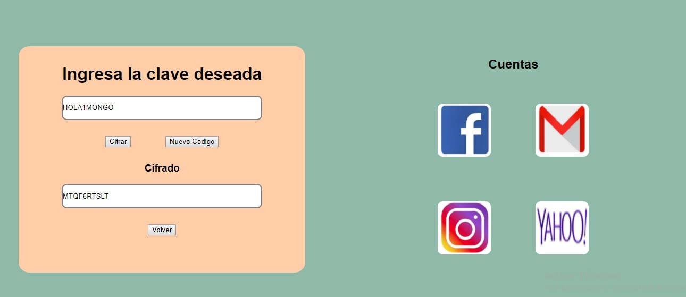
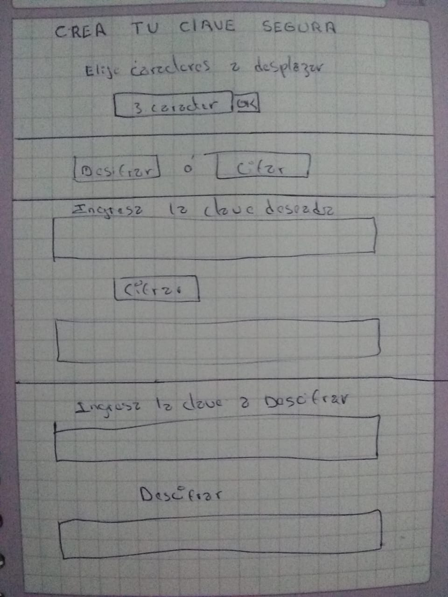

# Cifrado de Contraseña

## Índice

* [1. Preámbulo](#1-preámbulo)
* [2. Resumen del proyecto](#2-resumen-del-proyecto)
* [3. Imagen final del Proyecto](#3-imagen-final-del-proyecto)
* [4. Investigación UX](#4-investigacio-UX)
* [5. Criterios de aceptación mínimos del proyecto](#5-criterios-de-aceptación-mínimos-del-proyecto)
* [6. Hacker Edition](#6-hacker-edition)
* [7. Pistas, tips y lecturas complementarias](#6-pistas-tips-y-lecturas-complementarias)

## 1. Preámbulo

Todos utilizamos a diario contraseñas para acceder a nuestro correo electrónico, a las redes sociales, foros o para iniciar el ordenador.
Si usas una clave débil corres el riesgo de que algún intruso pueda descifrarla y tener acceso a tu información.
Sin duda crear una clave segura es la primera línea de protección en internet.

## 2. Resumen del proyecto

Es una aplicacion para crear una contraseña altamente segura para redes sociales, correos electronicos, etc.
Con el metodo cifrado César en el cual el usuario pueda cifrar y descifrar un
texto indicando un nivel de seguridad.

## 3. Imagen final del Proyecto

## 4. Investigacion UX

* Los uduarios son las personas que usan correos electronicos y redes sociales que necesitan un nivel de seguridad  confiable y personalizada en su contraseña.

* Evitamos que otra persona acseda a su cuenta con esta aplicacion hacemos mas segura la contraseña.

* Indicar a que tipo de usuario va dirigido.
* Centrarnos en primer lugar en la necesidad del usuario.
* Mejorar mi pantalla facilitar la navegacion del usuario.

[Figma](https://www.figma.com/file/USrbZzPlVRIcpT94ORl5rb/Proyecto-Cifrado?node-id=1%3A2)

## Objetivos de aprendizaje Cipher
​
A continuación te presentamos los objetivos de aprendizaje de este proyecto. Reflexiona y luego marca los objetivos que has llegado a **entender** y **aplicar** en tu proyecto.
​
### UX
​
- [x] Diseñar la aplicación pensando y entendiendo al usuario.
- [x] Crear prototipos para obtener feedback e iterar.
- [ ] Aplicar los principios de diseño visual (contraste, alineación, jerarquía).
​
### HTML y CSS
​
- [x] Uso correcto de HTML semántico.
- [x] Uso de selectores de CSS.
- [x] Construir tu aplicación respetando el diseño realizado (maquetación).
​
### DOM
​
- [x] Uso de selectores del DOM.
- [ ] Manejo de eventos del DOM.
- [x] Manipulación dinámica del DOM.
​
### Javascript
​
- [ ] Manipulación de strings.
- [x] Uso de condicionales (if-else | switch).
- [x] Uso de bucles (for | do-while).	
- [x] Uso de funciones (parámetros | argumentos | valor de retorno).
- [x] Declaración correcta de variables (const & let).
​
### Testing
- [ ] Testeo de tus funciones.
​
### Git y GitHub
- [x] Comandos de git (add | commit | pull | status | push).
- [ ] Manejo de repositorios de GitHub (clone | fork | gh-pages).
​
### Buenas prácticas de desarrollo
- [x] Uso de identificadores descriptivos (Nomenclatura | Semántica).
- [ ] Uso de linter para seguir buenas prácticas (ESLINT).

